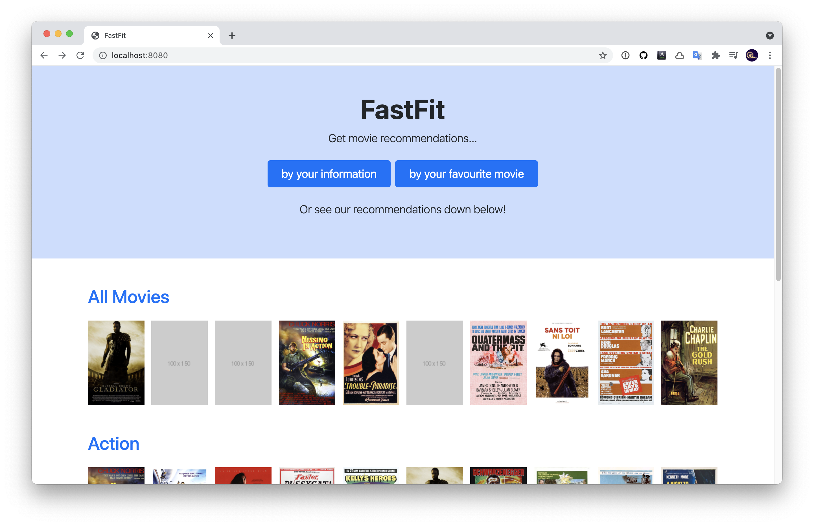

# FastFit

(This project is for UNIST CSE364 Software Engineering course.)




## What is FastFit?

FastFit is a movie recommendation system. We quickly(*fast*) find movies that *fits* your taste.

IMDb, an online database of movies, provide numerous information about movies. However, they don't have a recommendation system to look for more movies that fit your taste. So we created FastFit. We'll recommend movies based on your information or favorite movies.

FastFit provides both a web app and a REST API. Whether you are an end user or a developer, choose the service that is right for you.

Curious to see how it works? Feel free to check [How It Works](/docs/how-it-works.md) page.

## Getting Started

### Running the server

To use FastFit, you first need to run the server. After successfully running the server, **please wait about 10 minuites** until the database is filled. When you see the message `--- Start Service ---`, you can start sending requests to the server.

#### Deploying WAR file to Apache Tomcat on Docker (Recommended)

1. First, prepare the `cse364-project.war` file. You can find it in the releases page of the repository, or you can build it manually. To build the WAR file manually, run the following command.

   ```shell
   mvn clean package -P war-build -P init
   ```

2. Move the .war file into `./target` directory. If you built it manually, it will be already there.

3. Build the Docker image and run it. FastFit uses the port 8080 by default, and you might want to publish the port using the `-p` option.
  
   ```shell
   docker build -t cse364 ./
   docker run -p 8080:8080 -it cse364
   ```
   
   
#### Running JAR on Docker using run.sh

Once the Docker image is created, you can run JAR in the Docker container instead of deploying to Tomcat.

1. Run Docker conatiner with entry point bash.

   ```shell
   docker run -it --entrypoint=bash cse364
   ```
   
2. Execute `run.sh`

   ```shell
   . run.sh
   ```

#### Running JAR manually

1. Install MongoDB on the host machine, and start the `mongod` service.

2. Build a .jar file.

   ```shell
   mvn clean package -P init
   ```

3. Run the .jar file in the target folder.

   ```shell
   java -jar target/cse364-project.jar
   ```

### Using the web application

We provide a simple web application that serves as an interface for end users.

You can get movie recommendations by your information or your favorite movie. There are buttons on the main page that links to each recommendation page.

- **Recommendation by your information :** Enter your gender, age, occupation, or a list of your favorite movie genres. We'll suggest 10 movies you might enjoy according to the provided information. You can omit some fields if you want.

- **Recommendation by your favorite movie :** Enter your favorite movie title with its release year in the parentheses. (e.g. `Toy Story (1995)`) We'll recommend 10 similar movies for you.

Or, you can check our own recommendations on the main page. "All Movies" section shows the overall top 10 recommended movies. Next comes the genre sections. They show top 10 recommended movies by each genre.

Some input fields only accepts a limited number of values. To check which values are allowed, please see the [Available Inputs](/docs/available-inputs.md) page.

For more information, please see the [Web App](/docs/web.md) reference page.

### Using the REST API

For developers, there is a REST API to fetch the data in JSON format. This is a standard way to communicate the data programmatically, and it allows you to handle the data in any way you desire.

For example, you can get movie recommendations by your information as follows:

```shell
curl -X GET http://localhost:8080/users/recommendations -H 'Content-type:application/json' -d '{"gender": "M", "age": "24", "occupation": "college student", "genres": "animation|sci-fi"}'
```

FastFit API will send the movie recommendations.

```json
[
  {
    "title": "Make Mine Music (1946)",
    "genres": "Animation|Children's|Musical",
    "imdb": "http://www.imdb.com/title/tt0038718",
    "poster": "https://....jpg"
  },
  {
    "title": "Faust (1994)",
    "genres": "Animation|Comedy|Thriller",
    "imdb": "http://www.imdb.com/title/tt0109781",
    "poster": ""
  },
  {
    "title": "Brother from Another Planet, The (1984)",
    "genres": "Drama|Sci-Fi",
    "imdb": "http://www.imdb.com/title/tt0087004",
    "poster": "https://....jpg"
  },
  "..."
]
```

For more information, please see the [REST API](/docs/api.md) reference page.

## Development Guide

### Build

```
$ mvn package [-P profile1 -P profile2 ...]
```

#### Maven profiles

We use Maven profiles to customize build configurations.

- `init` : Enables a Spring batch job to initialize the MongoDB and fill the data. The batch job doesn't run when the database is already filled. Use this option in most cases.
- `war-build` : Builds a WAR package instead of a JAR package.

### Test

To test the codebase, run:

```
$ mvn test
```

After running the test command, open `target/site/jacoco/index.html` file in the browser to check the code coverage.

## References

- [Web App](/docs/web.md)
- [REST API](/docs/api.md)
- [Command Line Program (Deprecated)](/docs/cli.md)
- [Available Inputs](/docs/available-inputs.md)
- [How It Works](/docs/how-it-works.md)
- [Presentation](https://docs.google.com/presentation/d/1Sfc_JcOC9VNoQRpx6oe2AehTP-rtVzXSnRz0iKYGxfQ/edit?usp=sharing)

## Update History

- [Milestone 1](/docs/milestones/milestone1.md)
- [Milestone 2](/docs/milestones/milestone2.md)
- [Milestone 3](/docs/milestones/milestone3.md)
- [Milestone 4](/docs/milestones/milestone4.md)
